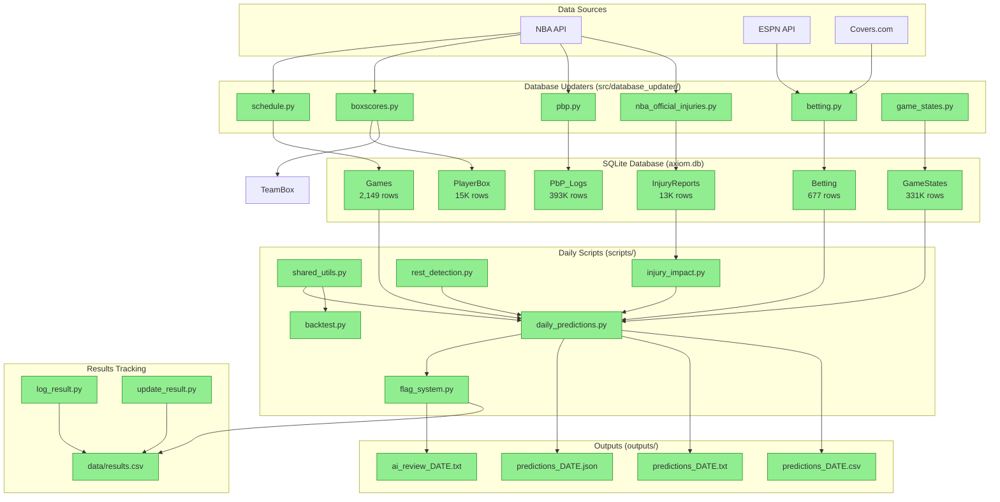
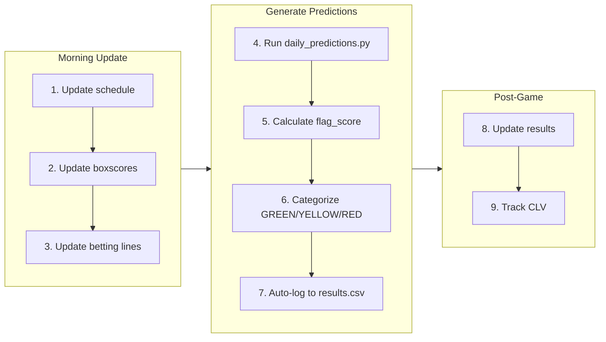
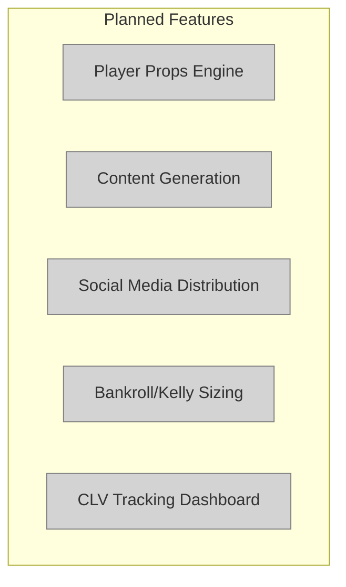

# AXIOM System Architecture

> Last updated: 2026-01-26

## System Overview



## Legend

| Symbol | Status |
|--------|--------|
| Green boxes | Built and working |
| Yellow boxes | In progress |
| Gray boxes | Planned |

## Daily Workflow



## Component Details

### Data Updaters (src/database_updater/)

| File | Purpose | Frequency |
|------|---------|-----------|
| `schedule.py` | Fetch NBA schedule | Daily |
| `boxscores.py` | Player/team box scores | After games |
| `pbp.py` | Play-by-play logs | After games |
| `betting.py` | Vegas lines from ESPN/Covers | Before games |
| `nba_official_injuries.py` | Injury reports | Daily |
| `game_states.py` | Reconstruct game states | After games |

### Scripts (scripts/)

| File | Purpose | Status |
|------|---------|--------|
| `daily_predictions.py` | Main prediction pipeline | Active |
| `flag_system.py` | Calculate flag_score, categorize zones | Active |
| `shared_utils.py` | Shared functions (team stats) | Active |
| `injury_impact.py` | Calculate injury adjustments | Active (disabled) |
| `rest_detection.py` | Detect B2B situations | Active |
| `backtest.py` | Historical validation | Active |
| `log_result.py` | Log new picks | Active |
| `update_result.py` | Update pick results | Active |
| `generate_performance_chart.py` | Visualization | Unused |

## Planned Components



## Database Schema Summary

| Table | Rows | Purpose |
|-------|------|---------|
| Games | 2,149 | Schedule and game metadata |
| GameStates | 331,193 | Point-in-time game snapshots |
| PlayerBox | 14,975 | Player box scores |
| TeamBox | 1,132 | Team box scores |
| Betting | 677 | Vegas lines and odds |
| InjuryReports | 13,034 | Player injury status |
| PbP_Logs | 393,325 | Play-by-play data |
| Players | 5,119 | Player metadata |
| Teams | 30 | Team metadata |

## The Proven Signal

```
injury_adj = 0  →  62.5% cover rate (p=0.018)
  + spread < 3  →  72.7% cover rate
  + B2B fade    →  71.4% cover rate

Flag Score Calculation:
  +5 if injury_adj == 0 (the signal)
  +3 if spread < 3
  +3 if opponent on B2B

Zone Thresholds:
  GREEN:  flag_score >= 8
  YELLOW: flag_score >= 5
  RED:    flag_score < 5
```
